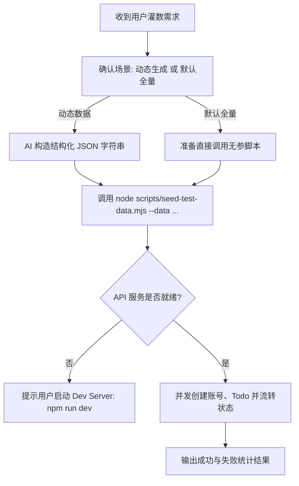

# Seed Test Data Skill

本 Skill 用于向系统批量生成并灌入拟真的用户账号与待办事项（Todo）数据。支持根据用户指定的业务场景由 AI 动态生成结构化 JSON 并通过命令行参数直接传入，也可以一键灌入内置的 20 个仿真人设与 120 条全状态数据。

> [!IMPORTANT]
> **无需生成临时数据文件**：直接使用 `--data '<JSON_STRING>'` 命令行参数向执行脚本提供数据。

---

## 1. 快速执行命令

### 方式 A：由 AI 动态生成业务场景数据（推荐）

通过 `--data` 参数直接传入 JSON 字符串：

```bash
node scripts/seed-test-data.mjs --data '[
  {
    "email": "dev.leader@tech.io",
    "nickname": "林工",
    "todos": [
      {
        "content": "重构公共 API 校验层与异常处理中间件",
        "category": "dev",
        "status": "in_progress",
        "note": "对齐 OpenAPI 规范",
        "isNotePublic": true,
        "startDate": "2026-08-29",
        "dueDate": "2026-09-03"
      },
      {
        "content": "编写 Svelte 5 单元测试覆盖核心 Runes 状态",
        "category": "dev",
        "status": "pending",
        "note": "覆盖 $state 和 $derived",
        "isNotePublic": true,
        "startDate": "2026-08-30"
      }
    ]
  }
]'
```

### 方式 B：使用内置默认数据集（20 个账号 × 6 条 Todo = 120 条）

```bash
node scripts/seed-test-data.mjs
```

### 常用参数说明

| 参数 | 缩写 | 默认值 | 说明 |
| :--- | :--- | :--- | :--- |
| `--data <json>` | `-d` | 无 | 外部 JSON 格式的账号与 Todo 数据字符串 |
| `--api-base <url>` | 无 | `http://localhost:3003/api` | 后端 API 基础地址（也可通过 `API_BASE` 环境变量指定） |
| `--concurrency <n>`| `-c` | `5` | 并发请求数 |
| `--dry-run` | 无 | `false` | 仅解析并校验数据结构，不发送网络请求 |
| `--help` | `-h` | 无 | 查看命令行帮助信息 |

---

## 2. AI 数据生成规范 (JSON Schema)

当用户提出具体场景（例如“模拟考研备考学生”、“生成一个 5 人初创团队的周计划”、“生成 50 条包含各种状态的数据”）时，AI 应在 Prompt 中构造符合以下结构的 JSON 字符串：

```typescript
type SeedPayload = Array<{
  /** 邮箱，用于唯一标识用户与自动创建账号 */
  email: string;
  /** 用户昵称（可选，缺省时自动取邮箱前缀） */
  nickname?: string;
  /** 该用户下的待办列表 */
  todos: Array<{
    /** Todo 内容（必填） */
    content: string;
    /** 分类（可选，枚举：study | dev | life | fitness | finance | other，缺省为 other） */
    category?: 'study' | 'dev' | 'life' | 'fitness' | 'finance' | 'other' | string;
    /** 状态（可选，枚举：pending | in_progress | done | abandoned，缺省为 pending） */
    status?: 'pending' | 'in_progress' | 'done' | 'abandoned';
    /** 备注信息（可选） */
    note?: string | null;
    /** 备注是否公开（可选，默认 true） */
    isNotePublic?: boolean;
    /** 开始日期 YYYY-MM-DD（可选，缺省为当天） */
    startDate?: string | null;
    /** 截止日期 YYYY-MM-DD（可选） */
    dueDate?: string | null;
  }>;
}>;
```

### 数据生成设计原则

1. **拟真性**：邮箱风格多样化（网易/QQ/Gmail/企业邮箱），昵称贴近真实网名或姓名。
2. **状态多样性**：根据场景合理分布 `pending`（待办）、`in_progress`（进行中）、`done`（已完成）、`abandoned`（已放弃）。
3. **内容自然**：文案具体可执行，包含适量的 `note` 备注与截止时间。

---

## 3. 工作流程与排错



### 常见问题与排查

- **网络请求失败 `ECONNREFUSED`**：表示本地后端服务未启动。请先启动开发服务器（`npm run dev`）。如果开发服务器运行在不同端口（如 `http://localhost:5173/api`），请通过 `--api-base http://localhost:5173/api` 指定。
- **JSON 解析失败**：在命令行传入 JSON 时，外层请使用单引号 `'...'` 包裹，避免双引号引起 shell 语法错误。
