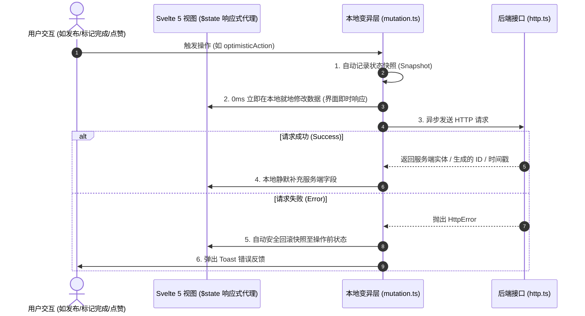

# ptdl-alpha — 前端架构设计与开发规范文档

> **文档状态**: 生产就绪 (Production Ready)  
> **适用对象**: 前端开发工程师、UI/UX 设计师、全栈工程师  
> **文档目标**: 记录与沉淀 ptdl-alpha 前端工程的整体技术选型、App Shell 统一布局标准、Svelte 5 响应式数据流范式、本地更新/乐观更新机制及原子 UI 组件规范。

---

## 1. 产品定位与核心设计哲学

我们的产品美学设计体系严格秉持五大核心支柱：**「极简、克制、高质感、内容为核心、可爱（灵动微动效）」**。

1. **极简 (Minimalist)**：
   - 界面无边界、无多余大边框、无生硬分割线；全屏背景、标题栏与内容流 100% 纯净统一，用优雅宽敞的留白（Whitespace）代替传统分割线；
   - 任何人均可免密快速发布 Todo，所有待办全网公开可见，免去繁琐的注册与认证流程。
2. **克制 (Restrained)**：
   - 采用高级 Zinc（中性冷灰）单色系架构，主次对比分明；
   - 弱化多人协同的冗余视觉噪音，分类仅以 6px 微圆点呼吸点缀，非参与者严格呈现清晰只读态。
3. **高质感 (High Texture & Craftsmanship)**：
   - 严格遵循 Linear / Apple 级别的精细化设计质感，毫米级精确把控深浅双主题下的文字可读性与 Hover 悬浮感知；
   - 顶部 Header 半透明毛玻璃（`backdrop-blur-md`）与纯净卡片阴影相互衬托。
4. **内容为核心 (Content-First)**：
   - 待办正文为最高视觉优先级，去除一切干扰阅读的多余大标题与装饰；
   - 专属多人协同元素在单人待办中完全隐匿，多人条目支持轻量行内折叠与展开。
5. **可爱 · 灵动微动效 (Playful & Delightful Micro-interactions)**：
   - 在严谨克制的单色系中注入“灵动可爱”的情感化设计：果冻弹性交互勾选框（`hover:scale-110`, `active:scale-85`）、鼠标悬停机敏弹出的微型 Tooltip 气泡、多人头像叠层扇形展开；
   - 打勾完成瞬间爆发 300 颗高饱和 3D 物理纸屑与彩带，全天个人待办全部搞定时引爆三次全屏超级大礼炮狂欢！
6. **本地就地响应优先 (Local-First Reactivity)**：
   - 所有交互操作在成功后**一律纯本地就地变异更新，绝对不重新全量请求 API 刷新列表**，保证 0 抖动、0 延迟与丝滑体验。

---

## 2. 技术栈选型矩阵

| 维度 | 选用技术 / 库 | 版本 | 选型理由 |
|---|---|---|---|
| **全栈应用框架** | SvelteKit | ^2.63.0 | 极佳的 SSR/CSR 性能，轻量高效的路由与端点集成 |
| **前端响应式引擎** | Svelte 5 (Runes) | ^5.56.1 | 采用 `$state`, `$derived`, `$props` 细粒度代理响应式，性能卓越 |
| **样式与设计系统** | Tailwind CSS v4 | ^4.3.0 | 现代 CSS-first 配置、极小打包体积、原生深色模式支持 |
| **编程语言** | TypeScript | ^6.0.3 | 严格类型检查 (`strict: true`)，与后端共享 DTO 契约 |
| **通用图标库** | `@iconify/svelte` (Lucide) | ^5.2.2 | 按需加载的高质量 SVG 图标体系 |
| **单元与逻辑测试** | Vitest | ^4.1.8 | 秒级测试执行，保障核心变异与工具函数质量 |

---

## 3. 应用骨架与统一布局规范 (App Shell & Layout)

### 3.1 布局架构草图

```
┌───────────────────────────────────────────────────────────────────┐
│ Header (h-14, sticky top-0, z-30, backdrop-blur-md, border-b)     │
│ [ ⚡ Brand Logo & Title ]                      [ User Avatar/Menu ]│
└───────────────────────────────────────────────────────────────────┘
│                                                                   │
│  Main Container (mx-auto, max-w-3xl sm:max-w-4xl, px-4, py-6~8)   │
│  min-h-[calc(100vh-3.5rem-5rem)]                                 │
│                                                                   │
│  ┌─────────────────────────────────────────────────────────────┐  │
│  │ Page Content Slot ({@render children()})                    │  │
│  │                                                             │  │
│  │ (极简居中聚焦单列流，为内容展现与创作提供最舒适的阅读视线)  │  │
│  │                                                             │  │
│  └─────────────────────────────────────────────────────────────┘  │
│                                                                   │
├───────────────────────────────────────────────────────────────────┤
│ Footer (py-6, border-t, text-xs text-zinc-400, text-center)       │
│ © 2026 ptdl-alpha · 全网公开协同 Todo · 任何人可发布 · 任何人可围观│
└───────────────────────────────────────────────────────────────────┘
│ Global Overlays (全局浮层):                                       │
│ ├── ToastContainer (fixed top-4 left-1/2 -translate-x-1/2 z-50)   │
│ ├── Modal / Dialog Portals (fixed inset-0 z-50)                   │
│ └── Mobile Drawer (fixed inset-y-0 right-0 w-72 z-40)              │
└───────────────────────────────────────────────────────────────────┘
```

### 3.2 区域详细规范

1. **顶部导航栏 (`Header.svelte`)**:
   - **尺寸与材质**: 高度固定 `h-14` (56px)，粘性置顶 `sticky top-0 z-30`，磨砂半透明背景 `bg-white/80 dark:bg-zinc-950/80 backdrop-blur-md`；
   - **左侧**: 品牌 Logo 图标徽章 + 产品名称（`font-semibold tracking-tight`）；
   - **右侧**: 嵌入 **Apple / Linear 风格的轻量悬浮气泡 (`UserPopover.svelte`)**，点击在头像下方自然下沉弹出。

2. **用户身份与偏好悬浮面板 (`UserPopover.svelte`)**:
   - **轻量透气**: 宽度 `w-72`，采用半透明毛玻璃材质（`backdrop-blur-md`），带 `zoom-in-95` 弹性微展开动效，点击外部或按 `ESC` 自动自然收回；
   - **未绑定身份时**：直接展示极简邮箱输入框与保存按钮，回车即绑定；
   - **已绑定身份时**：展示当前头像、昵称、邮箱，提供「更换邮箱」与「退出身份」功能；
   - **原地无缝切换**：点击「更换邮箱」时，Popover 原地平滑切换为输入表单，无需嵌套弹窗；
   - **外观偏好**：内嵌浅色 (Light)、深色 (Dark)、跟随系统 (System) 三挡一键切换分段按钮。

3. **主工作区 Main (`+layout.svelte`)**:
   - 居中单列流：`mx-auto w-full max-w-3xl sm:max-w-4xl px-4 sm:px-6 py-6 sm:py-8`；
   - 弹性自适应高度：`min-h-[calc(100vh-3.5rem-5rem)]`，确保页面内容较少时 Footer 始终自然贴底。

4. **底部栏 (`Footer.svelte`)**:
   - 极简居中单行：展示版权信息与“全网公开协同 Todo · 任何人可发布 · 任何人可围观”核心理念。

---

## 4. 数据流、排序算法与本地变异架构 (Data Flow & Mutation)

### 4.1 核心原则：0ms 本地就地变异优先
为了彻底避免传统 SPA “操作一次就全量 refetch 导致列表重绘、滚动跳跃、Spinner 闪烁”的糟糕体验，系统严格遵循：**服务端成功/客户端先行，纯本地就地变异响应**。
- **发布待办 / 加入一起做**：0ms 立即在本地列表插入或并入多人聚合，绝不发起全量 Refetch；
- **打勾完成 / 切换状态**：0ms 就地更新状态与统计数据，绝不发起全量 Refetch；
- **精准隔离**：仅在用户真正切换日期或在抽屉里切换了不同账号时才会重新拉取服务端数据。



### 4.2 待办条目排序核心准则：【个人感知时间优先 (Personal Effective Time)】

#### 决策背景与原因：
1. **防跳动 (Anti-Jittering)**：Todo 类应用必须严格按「创建时间」而非「更新时间」排序，避免打勾或修改备注时列表条目上下剧烈跳动，破坏用户的空间视觉记忆；
2. **个人心流对齐**：对于当前用户参与的目标，用户是在当下的时间点做出行动承诺的。若机械地按早上的首发时间排在最底，用户加入后会产生“任务丢失”的割裂感。

#### 有效时间戳计算公式：
$$\text{effectiveCreatedAt} = \begin{cases} 
\text{myParticipant.createdAt} & \text{若当前用户已参与/发布} \\
\min_{p \in \text{participants}}(\text{p.createdAt}) & \text{若当前用户未参与}
\end{cases}$$

- **交互表现**：未参与的他人目标按全网首发时间排列；一旦当前用户点击「+ 加入一起做」，该条目在本地被赋予当下的最新时间戳，**0ms 顺畅自然地置顶到列表最上方**，让用户确信新任务已就绪；在“我的 (Mine)”视角下严格按个人加入时间倒序排列。

---

## 5. 首页核心模块与「极简·克制·高质感·内容为核心·可爱」美学规范

### 5.1 纯净沉浸流与无边界留白 (极简、克制、高质感)
- **背景 100% 统一**：全屏大背景、顶部标题栏与内容流统一为同一抹纯净白 (`bg-white`) / 深邃黑 (`dark:bg-zinc-950`)，彻底消除卡片嵌套的割裂感；
- **留白代替分割线**：彻底移除条目间生硬的分割线 (`divide-y`) 与外卡片边框，采用舒适宽敞的行间距 (`space-y-2`) 与内边距 (`px-4 py-3`)，内容如手账纸页般通透流淌；
- **高对比度深色模式 Hover**：深色模式采用清晰优雅的纯色深炭灰 `dark:hover:bg-zinc-900`，触控悬浮呼吸感分明。

### 5.2 Twitter / X 风格极简快速发布框 (内容为核心、极简)
- **自适应与自动收缩**：未聚焦时收缩为超紧凑单行输入条，聚焦时平滑展开多行编辑区并浮现分类药丸工具栏；
- **智能收起**：按下 `Escape` 或鼠标点击外部（Click Outside）无内容时自动平滑收缩回单行；
- **极速发布**：支持 `Enter` 一键快捷发送、0ms 乐观置顶插入。

### 5.3 灵动微动效与全屏庆祝 (可爱、高质感、情感化)
- **果冻弹性复选框**：1px 边框与他人一致，边框色同他人勾选色 (`zinc-600/300`)，带 `hover:scale-110` 放大与 `active:scale-85` 果冻物理按压手感；
- **单人/多人头像规范统一**：通过 Svelte 5 Snippet 统一头像行为，所有头像均支持悬停机敏弹出微型 Tooltip (`昵称 @handle`)；多人叠层支持鼠标悬停扇形轻柔展开 (Fan-out)；
- **全屏高饱和物理纸屑 (Canvas Confetti Engine)**：单次打勾喷发 300 颗高饱和 3D 纸片、彩带与星形粒子；当日全部达成触发连续三次全屏超级大礼炮 (800+ 颗) 狂欢。

---

## 6. 通用原子 UI 组件库规范 (`src/lib/components/ui/`)

所有组件严格基于 **Svelte 5 Runes** 与 **Tailwind CSS v4** 编写，属性严格类型化：

| 组件名称 | 核心 Props / 特性 | 说明 |
|---|---|---|
| `Button.svelte` | `variant`, `size`, `loading`, `disabled`, `leftIcon`, `rightIcon` | 支持 primary, secondary, outline, ghost, danger 等样式 |
| `Input.svelte` | `bind:value`, `type`, `label`, `error`, `helperText`, `size`, `leftIcon`, `rightIcon` | 受控文本输入框，支持错误高亮与图标插槽 |
| `Textarea.svelte` | `bind:value`, `label`, `error`, `rows`, `maxLength` | 自适应多行文本输入，支持字符计数 |
| `Select.svelte` | `bind:value`, `options`, `label`, `error`, `size` | 统一美观的下拉选择框 |
| `Checkbox.svelte` | `bind:checked`, `label`, `disabled` | 优雅的复选框控件 |
| `Badge.svelte` | `variant`, `size`, `dot` | 状态与分类胶囊徽章（neutral, primary, success, warning, danger, purple, pink） |
| `Card.svelte` | `hoverable`, `header`, `children`, `footer`, `onclick` | 基础卡片容器，支持头部/主体/尾部插槽 |
| `Avatar.svelte` | `src`, `name`, `size`, `status` | 支持图片 URL、DiceBear 动态算法 Fallback 与首字母缩写 Fallback |
| `Modal.svelte` | `bind:open`, `title`, `description`, `size`, `header`, `children`, `footer` | 通用弹窗，支持 ESC 关闭、点击遮罩关闭与平滑过渡动效 |
| `Spinner.svelte` | `size`, `class` | 统一的轻量旋转 Loading 指示器 |
| `EmptyState.svelte` | `title`, `description`, `icon`, `actions` | 通用空状态占位展示 |
| `Toast.svelte` | `item: ToastItem` | 单条浮动通知消息（success, error, info, warning） |
| `ToastContainer.svelte`| 全局自动监听 `toast` Store | 顶部居中浮动通知堆叠容器 |

---

## 7. 网络与全局状态管理

### 7.1 网络层 (`src/lib/services/http.ts`)
- 封装统一的 `http.get`, `http.post`, `http.patch`, `http.put`, `http.delete`；
- 结构化异常类 `HttpError`，自动解析服务端标准错误报文 `{ error: { code, message } }`；
- 自动集成全局 `toast.error` 提醒（支持 `silent: true` 静默模式）。

### 7.2 状态管理层 (`src/lib/stores/`)
- `toast.svelte.ts`: 全局通知 Store（支持 `toast.success()`, `toast.error()`, `toast.info()`, `toast.warning()`）；
- `theme.svelte.ts`: 全局明暗模式 Store（支持 `light`, `dark`, `system` 切换与本地持久化，监听 OS 色彩变更）；
- `user.svelte.ts`: 用户免密 Session 与服务端档案同步管理。

---

## 8. 质量保证与测试体系

```bash
# 1. 运行全量 TypeScript 严格类型与 Svelte 5 Runes 检查
npm run check

# 2. 运行前端工具与本地变异函数自动化测试
npx vitest run src/lib/utils/__tests__/

# 3. 执行生产构建打包
npm run build
```

