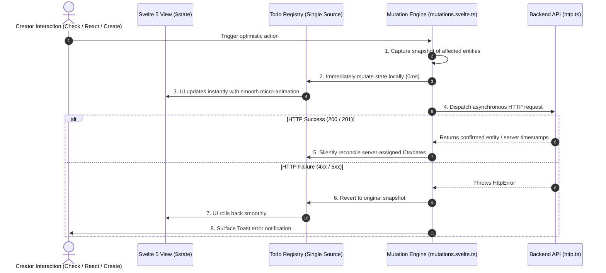

# ShowTodo — Frontend Architecture & Design System Specification

> **Document Status**: Production Ready  
> **Audience**: Frontend Developers, UI/UX Designers, Fullstack Engineers  
> **Core Ethos**: Built on the foundations of **Building in Public · Walking Together · Companionship · Mutual Accountability · Emulation & Learning · Social Witnessing**.

---

## 1. Product Positioning & Aesthetic Philosophy

`ShowTodo` is **not** a bureaucratic task delegation platform or collaborative workplace dashboard. It is a **public-first, companion-driven action space**. 

Our design philosophy is anchored in six pillars:

1. **High Signal-to-Noise Ratio (高信噪比)**:
   - Every pixel serves the creator’s action and focus. No decorative fluff, no banner noise, and no aggressive promotional widgets.
   - Tasks are front-and-center, using generous whitespace and subtle borders instead of heavy divider lines.
2. **Progressive Disclosure (渐进式呈现)**:
   - Simple tasks appear clean and unburdened. Multi-participant details, activity logs, notes, and reaction rosters are gracefully tucked into intuitive hover states, collapsible rows, or dedicated views.
3. **Walk Together, Not Managing (同行而非管理)**:
   - Creators doing identical goals are presented as equal companions. There are no "task owners" assigning work to "subordinates".
4. **Radical Transparency & Building in Public (公开透明 · 围观见证)**:
   - Todo commitments and progress timestamps are public by default. Public exposure transforms solitary anxiety into visible resolve.
5. **Playful & Delightful Micro-interactions (灵动可爱的微交互)**:
   - Jelly-bounce checkboxes (`hover:scale-110`, `active:scale-85`), smooth popovers, fan-out avatar clusters, and 3D physical confetti celebrations upon milestone completion.
6. **Local-First Zero-Jitter Reactivity (本地就地变异优先)**:
   - Every mutation updates local Svelte 5 `$state` instantaneously (0ms), avoiding full-page refetches, layout shift, or loading flashes.

---

## 2. Technology Stack

| Layer | Chosen Technology | Version | Purpose |
|---|---|---|---|
| **Fullstack Framework** | [SvelteKit](https://kit.svelte.dev/) | `^2.63.0` | File-system routing, SSR/CSR, seamless endpoint bindings |
| **Reactivity Engine** | [Svelte 5 (Runes)](https://svelte.dev/) | `^5.56.1` | Fine-grained proxy reactivity via `$state`, `$derived`, `$props`, `$effect` |
| **Design System & Styling** | [Tailwind CSS v4](https://tailwindcss.com/) | `^4.3.0` | Modern CSS-first engine, dark mode tokens, `@tailwindcss/forms` |
| **Language** | [TypeScript](https://www.typescriptlang.org/) | `^6.0.3` | Strict type safety, shared domain DTO contracts |
| **Iconography** | `@iconify/svelte` (Lucide) | `^5.2.2` | Clean, customizable vector icons loaded on-demand |
| **Test Framework** | [Vitest](https://vitest.dev/) | `^4.1.8` | Component and mutation unit test suites |

---

## 3. Application Shell & Complete Route Matrix

### 3.1 App Shell Layout Structure

```
┌───────────────────────────────────────────────────────────────────┐
│ Header (h-14, sticky top-0, z-30, backdrop-blur-md, border-b)     │
│ [ ⚡ Logo & Navigation Links ]                 [ UserPopover / Menu ]│
└───────────────────────────────────────────────────────────────────┘
│ TopProgressBar (fixed top-0 inset-x-0 h-0.5 z-50 during requests) │
│                                                                   │
│  Main Container (mx-auto, max-w-4xl px-4 sm:px-6 py-6~8)          │
│  min-h-[calc(100vh-3.5rem-5rem)]                                 │
│                                                                   │
│  ┌─────────────────────────────────────────────────────────────┐  │
│  │ Page Content Slot ({@render children()})                    │  │
│  └─────────────────────────────────────────────────────────────┘  │
│                                                                   │
├───────────────────────────────────────────────────────────────────┤
│ Footer (py-6, border-t, text-xs text-zinc-400, text-center)       │
│ © 2026 ShowTodo · Build in Public · Walk Together · Anyone can Join│
└───────────────────────────────────────────────────────────────────┘
│ Global Overlays:                                                  │
│ ├── ToastContainer (fixed top-4 left-1/2 -translate-x-1/2 z-50)   │
│ ├── CreateTodoModal (fixed inset-0 z-50)                          │
│ └── Modal Dialog Portals (fixed inset-0 z-50)                     │
└───────────────────────────────────────────────────────────────────┘
```

### 3.2 Full Route Panorama

| Route Path | View / Component | Core Purpose & Data Requirements |
|---|---|---|
| `/` | `TodoStreamView` / `TodoKanbanView` / `TodoCalendarView` | Main Action Square: Triple-view todo feed, today check-ins, companion goals |
| `/@handle` | `UserProfileCard`, `ActivityHeatmap`, `UserStatsGrid` | Public Creator Profile: 365-day contribution streak, stats overview, bio |
| `/@handle/todolist` | `TodoItem` list, filters | Creator’s dedicated public action list |
| `/goals` | `TopicCard` list, search, filters | Walk-Together Goals Directory: Leaderboard of active goals |
| `/goals/[hash]` | `TopicHeaderCard`, `TopicParticipantList` | Companion Goal Detail: Participants roster, today vs all-time completions |
| `/trending` | `TrendingTopicsWidget`, `TopicCard` | High-momentum goals leaderboard |
| `/trending/[hash]` | Redirect / Goal Detail | Companion Goal Detail by trending link |
| `/stats` | `SiteStatsWidget`, `CategoryDonutChart`, `ActivityHeatmap` | Platform Observability: Total todos, completion rate, global heatmap, top creators |
| `/t/[id]` | `TodoDetailCard`, `TodoActivityTimeline` | Todo Detail & Companion Timeline: ShortId sharing link, growth story logs |
| `/about` | Static content | Philosophy statement: Build in Public, Companionship, Supervision, Emulation |
| `/privacy` | Static content | Privacy commitment: Email protection, public todo transparency |
| `/(dev)/demo` | UI Showcase | Interactive showcase for atomic design tokens and components |

---

## 4. Svelte 5 Runes State Architecture

The frontend state layer is decoupled into **Entity Registries**, **Resource Stores**, and **Global Runes Stores**:

```
src/lib/stores/
├── entities/                   # Single Source of Truth Registries
│   ├── todo-registry.svelte.ts # Reactive Map of Todo entities
│   └── user-registry.svelte.ts # Reactive Map of User entities
├── resources/                  # Svelte 5 Runes Resource Controllers
│   ├── use-my-todos.svelte.ts  # Filtered personal todos stream
│   ├── use-todo-detail.svelte.ts # Deep todo inspection with activities
│   ├── use-topics.svelte.ts    # Walk-together goals directory & search
│   ├── use-topic-detail.svelte.ts # Topic detail & companion list
│   └── use-user-profile.svelte.ts # Creator profile & heatmap loader
├── user.svelte.ts              # Passwordless session identity
├── theme.svelte.ts             # Light / Dark / System theme switcher
├── toast.svelte.ts             # Global notification queue
├── progress.svelte.ts          # Top progress bar controller
├── feed.svelte.ts              # Action square feed state
├── today.svelte.ts             # Today action card state
├── stats.svelte.ts             # Public platform analytics state
├── trending.svelte.ts          # Trending goals state
├── create-todo-modal.svelte.ts # Modal trigger & pre-filled category
└── mutations.svelte.ts         # Local-first optimistic action engine
```

### 4.1 Single Source of Truth Entity Registry
To avoid data divergence across views (e.g., ticking a todo in the Feed while the Kanban or Detail modal is open), `todoRegistry` maintains a normalized reactive store of entities:
- Any update via `todoRegistry.upsert(todo)` updates the underlying `$state` proxy in place.
- All components holding references to that todo reactively re-render with zero roundtrips.

### 4.2 Local-First Mutation Sequence



### 4.3 Anti-Jitter Sorting: Personal Effective Time
When aggregating companion cards, sorting strictly uses **Personal Effective Time**:
$$\text{effectiveCreatedAt} = \begin{cases} 
\text{myParticipant.createdAt} & \text{if current user has joined} \\
\min_{p \in \text{participants}}(\text{p.createdAt}) & \text{if viewing as observer}
\end{cases}$$

- Joining a companion goal immediately sets your personal timestamp to `now`, smoothly floating the goal to the top of your personal list without shifting it unexpectedly for observers.

---

## 5. View Architecture & Triple-View Engine

The Action Square (`src/routes/+page.svelte`) provides three fluid lenses onto the public todo data:

### 5.1 Stream View (`TodoStreamView.svelte`)
- **Focus**: High-efficiency, chronological feed.
- **Features**: Inline `TodoComposer` at the top, category filter pill bar with URL synchronization, compact companion avatars, and fast check-off buttons.

### 5.2 Kanban View (`TodoKanbanView.svelte`)
- **Focus**: Workflow organization across 3 swimlanes:
  1. `pending` (待办中)
  2. `in_progress` (推进中)
  3. `done` (已达成)
- **Features**: Drag/move quick actions, status counters, and companion tags.

### 5.3 Weekly Calendar View (`TodoCalendarView.svelte`)
- **Focus**: Time-horizon alignment and multi-creator visibility.
- **Features**: Natural calendar week grid (Monday to Sunday), user-first swimlanes showing only creators with active commitments that week, and current user pinned to the top.

---

## 6. Design System & Component Registry

### 6.1 Four-State Status Lifecycle & Visual Tokens

| State | Code | Symbol | Styling & Interaction |
|---|---|:---:|---|
| **Pending** | `pending` | `○` | Hollow circle with `stroke-[2.2]`. Click to mark done (triggers confetti). Hover for 4-state popover. |
| **In Progress** | `in_progress` | `◔` | 1/4 filled pie icon. High-contrast text. Click to mark done. |
| **Completed** | `done` | `✓` | Solid black/white background with bold checkmark. Strikethrough text (`text-zinc-500 line-through`). Click to reopen. |
| **Abandoned** | `abandoned` | `✕` | Subtle gray background with diagonal cross. Low opacity text. Click to reopen. |

### 6.2 Reaction Emojis & Token Mappings

| Emoji | Name | Active Token Class |
|:---:|---|---|
| `❤️` | Heart | `bg-rose-50 border-rose-300 text-rose-700 dark:bg-rose-950/50 dark:border-rose-700` |
| `👍` | Like | `bg-blue-50 border-blue-300 text-blue-700 dark:bg-blue-950/50 dark:border-blue-700` |
| `🔥` | Fire | `bg-orange-50 border-orange-300 text-orange-700 dark:bg-orange-950/50 dark:border-orange-700` |
| `💪` | Strong | `bg-emerald-50 border-emerald-300 text-emerald-700 dark:bg-emerald-950/50 dark:border-emerald-700` |
| `👏` | Clap | `bg-amber-50 border-amber-300 text-amber-700 dark:bg-amber-950/50 dark:border-amber-700` |
| `🚀` | Rocket | `bg-indigo-50 border-indigo-300 text-indigo-700 dark:bg-indigo-950/50 dark:border-indigo-700` |
| `🎉` | Party | `bg-yellow-50 border-yellow-300 text-yellow-700 dark:bg-yellow-950/50 dark:border-yellow-700` |
| `👀` | Watching | `bg-zinc-100 border-zinc-300 text-zinc-700 dark:bg-zinc-800 dark:border-zinc-700` |

### 6.3 Typography & Readability Hierarchy
- **Todo Content**: `15px` (`text-[15px]`), `leading-snug`, high-contrast foreground (`text-zinc-900 dark:text-zinc-100`).
- **Creator Nickname**: `12px` (`text-xs`), `font-semibold`.
- **Timestamps & Deadlines**: `11px` (`text-[11px] font-mono text-zinc-400 dark:text-zinc-500`).
  - Urgent countdown: highlights in warm amber (`text-amber-600 dark:text-amber-400 font-medium`) when deadline is within 2 hours.
- **Category Badge**: `10px` (`text-[10px] font-medium tracking-wide`).

---

### 6.4 Component Directory (`src/lib/components/`)

```
src/lib/components/
├── layout/
│   ├── Header.svelte           # Top sticky header with Logo & UserPopover
│   ├── Footer.svelte           # Clean bottom footer with philosophy tag
│   └── UserPopover.svelte      # Apple-style floating account panel
├── todo/
│   ├── TodoItem.svelte         # Primary todo card with responsive actions
│   ├── TodoStreamView.svelte   # Stream list view
│   ├── TodoKanbanView.svelte   # Kanban 3-lane view
│   ├── TodoCalendarView.svelte # Weekly creator calendar matrix
│   ├── TodoDetailCard.svelte   # Deep detail card with metadata
│   ├── TodoActivityTimeline.svelte # Check-in growth log timeline
│   ├── TodoComposer.svelte     # Instant todo creation form
│   ├── TodoStatusDropdown.svelte # 4-state selector dropdown
│   ├── TodoStatusIcon.svelte   # Animated status icon
│   ├── TodoCheckbox.svelte     # Jelly-bounce interactive check control
│   ├── TodoContent.svelte      # Text content with tag parsing
│   ├── TodoReactionsBar.svelte # 8-emoji cheering bar
│   ├── ReactionButton.svelte   # Single animated reaction pill
│   ├── CategoryBadge.svelte    # Dot & label category capsule
│   └── CreateTodoModal.svelte  # Global quick-create modal
├── topic/
│   ├── TopicCard.svelte        # Companion goal summary card
│   ├── TopicHeaderCard.svelte  # Goal detail hero header
│   └── TopicParticipantList.svelte # Companion peers roster
├── user/
│   ├── UserProfileCard.svelte  # Creator profile card with stats
│   ├── UserStatsGrid.svelte    # Streak & completion metric tiles
│   └── UserAvatarTooltip.svelte # Hover tooltip with creator details
├── stats/
│   ├── ActivityHeatmap.svelte  # 365-day SVG contribution heatmap
│   └── CategoryDonutChart.svelte # Category distribution SVG donut
├── widgets/
│   ├── MyTodayWidget.svelte    # Today's personal commitments widget
│   ├── TrendingTopicsWidget.svelte # Top trending goals widget
│   └── SiteStatsWidget.svelte  # Platform statistics summary widget
├── skeleton/
│   ├── FeedSkeleton.svelte
│   ├── StatsSkeleton.svelte
│   ├── TodoDetailSkeleton.svelte
│   ├── TopicDetailSkeleton.svelte
│   ├── TopicListSkeleton.svelte
│   ├── UserProfileSkeleton.svelte
│   └── WidgetSkeleton.svelte
├── seo/
│   └── SeoHead.svelte          # Dynamic OpenGraph and meta tags
└── ui/
    ├── Avatar.svelte           # DiceBear + image fallback avatar
    ├── BackToSquare.svelte     # Breadcrumb back navigation button
    ├── Badge.svelte            # Versatile tag badge
    ├── BreadcrumbNav.svelte    # Breadcrumb trail navigation
    ├── Button.svelte           # Multi-variant button
    ├── Card.svelte             # Container card with slots
    ├── Checkbox.svelte         # Styled form checkbox
    ├── DataView.svelte         # Switcher container between views
    ├── EmptyState.svelte       # Friendly empty illustration & copy
    ├── ExpandableFilterBar.svelte # Responsive filter pill bar
    ├── FilterChip.svelte       # Category filter toggle chip
    ├── Input.svelte            # Controlled input field
    ├── Modal.svelte            # Dialog modal with escape & backdrop
    ├── Popover.svelte          # Floating positioning container
    ├── SearchInput.svelte      # Debounced search bar
    ├── Select.svelte           # Styled select control
    ├── Skeleton.svelte         # Pulsing placeholder shape
    ├── Spinner.svelte          # Lightweight loader indicator
    ├── Tabs.svelte             # Segmented control tab bar
    ├── Textarea.svelte         # Auto-resizing textarea
    ├── Toast.svelte            # Notification message pill
    ├── ToastContainer.svelte   # Floating notification viewport
    └── TopProgressBar.svelte   # Top-edge network activity bar
```

---

## 7. Quality Assurance & Verification SOP

```bash
# 1. Run full Svelte 5 and TypeScript type verification
npm run check

# 2. Run Vitest component, store, and utility tests
npx vitest run src/lib/components/ src/lib/stores/ src/lib/utils/

# 3. Production build test
npm run build
```


