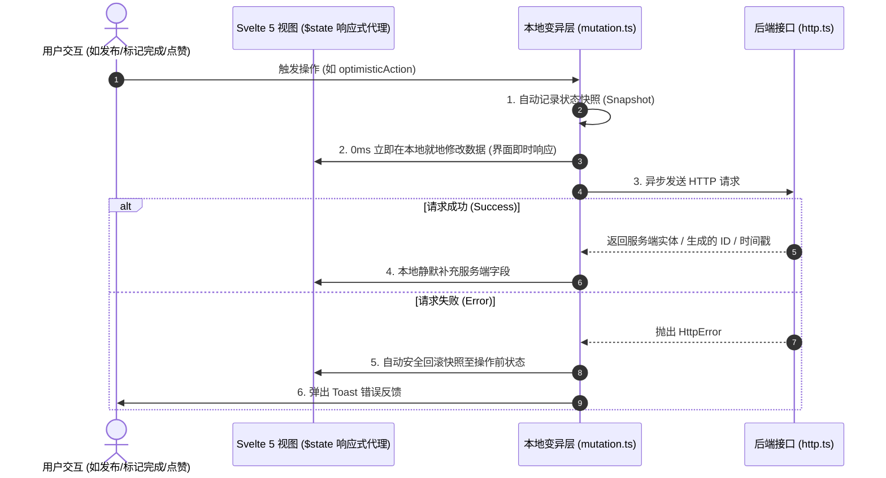

# ptdl-alpha — 前端架构设计与开发规范文档

> **文档状态**: 生产就绪 (Production Ready)  
> **适用对象**: 前端开发工程师、UI/UX 设计师、全栈工程师  
> **文档目标**: 记录与沉淀 ptdl-alpha 前端工程的整体技术选型、App Shell 统一布局标准、Svelte 5 响应式数据流范式、本地更新/乐观更新机制及原子 UI 组件规范。

---

## 1. 产品定位与核心设计哲学

1. **极简、公开、轻量**：
   - 任何人均可快速发布 Todo，所有待办对全网公开可见；
   - 采用 WordPress 评论免密码模式（输入邮箱即绑定身份），降低用户参与门槛。
2. **纯粹的产品化设计**：
   - 界面面向真实终端用户，杜绝任何开发者调试信息、技术栈标语或测试假数据残留；
   - 追求极致的清爽、聚焦与高质感。
3. **本地就地响应优先 (Local-First Reactivity)**：
   - 用户的所有交互操作（新建、状态流转、点赞、编辑等）在成功后**一律纯本地就地变异更新，绝对不重新全量请求 API 刷新列表**，保证 0 抖动、0 延迟与丝滑体验。

---

## 2. 技术栈选型矩阵

| 维度 | 选用技术 / 库 | 版本 | 选型理由 |
|---|---|---|---|
| **全栈应用框架** | SvelteKit | ^2.63.0 | 极佳的 SSR/CSR 性能，轻量高效的路由与端点集成 |
| **前端响应式引擎** | Svelte 5 (Runes) | ^5.56.1 | 采用 `$state`, `$derived`, `$props` 细粒度代理响应式，性能卓越 |
| **样式与设计系统** | Tailwind CSS v4 | ^4.3.0 | 现代 CSS-first 配置、极小打包体积、原生深色模式支持 |
| **编程语言** | TypeScript | ^6.0.3 | 严格类型检查 (`strict: true`)，与后端共享 DTO 契约 |
| **通用图标库** | `@iconify/svelte` (Lucide) | ^5.2.2 | 按需加载的高质量 SVG 图标体系 |
| **单元与逻辑测试** | Vitest | ^4.1.8 | 秒级测试执行，保障核心变异与工具函数质量 |

---

## 3. 应用骨架与统一布局规范 (App Shell & Layout)

### 3.1 布局架构草图

```
┌───────────────────────────────────────────────────────────────────┐
│ Header (h-14, sticky top-0, z-30, backdrop-blur-md, border-b)     │
│ [ ⚡ Brand Logo & Title ]                      [ User Avatar/Menu ]│
└───────────────────────────────────────────────────────────────────┘
│                                                                   │
│  Main Container (mx-auto, max-w-3xl sm:max-w-4xl, px-4, py-6~8)   │
│  min-h-[calc(100vh-3.5rem-5rem)]                                 │
│                                                                   │
│  ┌─────────────────────────────────────────────────────────────┐  │
│  │ Page Content Slot ({@render children()})                    │  │
│  │                                                             │  │
│  │ (极简居中聚焦单列流，为内容展现与创作提供最舒适的阅读视线)  │  │
│  │                                                             │  │
│  └─────────────────────────────────────────────────────────────┘  │
│                                                                   │
├───────────────────────────────────────────────────────────────────┤
│ Footer (py-6, border-t, text-xs text-zinc-400, text-center)       │
│ © 2026 ptdl-alpha · 全网公开协同 Todo · 任何人可发布 · 任何人可围观│
└───────────────────────────────────────────────────────────────────┘
│ Global Overlays (全局浮层):                                       │
│ ├── ToastContainer (fixed top-4 left-1/2 -translate-x-1/2 z-50)   │
│ ├── Modal / Dialog Portals (fixed inset-0 z-50)                   │
│ └── Mobile Drawer (fixed inset-y-0 right-0 w-72 z-40)              │
└───────────────────────────────────────────────────────────────────┘
```

### 3.2 区域详细规范

1. **顶部导航栏 (`Header.svelte`)**:
   - **尺寸与材质**: 高度固定 `h-14` (56px)，粘性置顶 `sticky top-0 z-30`，磨砂半透明背景 `bg-white/80 dark:bg-zinc-950/80 backdrop-blur-md`；
   - **左侧**: 品牌 Logo 图标徽章 + 产品名称（`font-semibold tracking-tight`）；
   - **右侧**: 仅保留用户头像入口（`Avatar`），点击唤起个人设置侧滑抽屉；
   - **克制原则**: 顶部保持极度纯粹，不放置繁杂的文字菜单。

2. **个人与偏好侧滑抽屉 (`MobileDrawer.svelte`)**:
   - 从右侧平滑滑出（`w-72`），点击遮罩或按 `ESC` 自动收起；
   - **未绑定身份时**：引导用户输入邮箱快速绑定身份；
   - **已绑定身份时**：展示当前头像、昵称、邮箱，提供“更换邮箱”与“退出身份”功能；
   - **外观偏好**：提供浅色 (Light)、深色 (Dark)、跟随系统 (System) 三挡一键切换。

3. **主工作区 Main (`+layout.svelte`)**:
   - 居中单列流：`mx-auto w-full max-w-3xl sm:max-w-4xl px-4 sm:px-6 py-6 sm:py-8`；
   - 弹性自适应高度：`min-h-[calc(100vh-3.5rem-5rem)]`，确保页面内容较少时 Footer 始终自然贴底。

4. **底部栏 (`Footer.svelte`)**:
   - 极简居中单行：展示版权信息与“全网公开协同 Todo · 任何人可发布 · 任何人可围观”核心理念。

---

## 4. 数据流与本地变异架构 (Local Mutation Architecture)

### 4.1 核心原则
为了彻底避免传统 SPA “操作一次就全量 refetch 导致列表重绘、滚动跳跃、Spinner 闪烁”的糟糕体验，系统严格遵循：**服务端成功/客户端先行，纯本地就地变异响应**。



### 4.2 本地变异工具函数契约 (`src/lib/utils/mutation.ts`)

- `insertItem(list, item, position)`: 0ms 在本地数组顶部（或末尾）就地推入新项；
- `updateItem(list, idOrPredicate, patch)`: 根据 ID 或判断函数，在本地数组中精准就地合并修改属性（仅触发受影响节点的微更新）；
- `removeItem(list, idOrPredicate)`: 0ms 从本地列表中安全剔除指定项；
- `upsertItem(list, item, keyName)`: 存在则就地更新，不存在则推入顶部；
- `optimisticAction({ apply, rollback, action, onError })`: 乐观更新执行器，自动处理本地先行应用、网络请求与失败秒级回滚。

---

## 5. 通用原子 UI 组件库规范 (`src/lib/components/ui/`)

所有组件严格基于 **Svelte 5 Runes** 与 **Tailwind CSS v4** 编写，属性严格类型化：

| 组件名称 | 核心 Props / 特性 | 说明 |
|---|---|---|
| `Button.svelte` | `variant`, `size`, `loading`, `disabled`, `leftIcon`, `rightIcon` | 支持 primary, secondary, outline, ghost, danger 等样式 |
| `Input.svelte` | `bind:value`, `type`, `label`, `error`, `helperText`, `size`, `leftIcon`, `rightIcon` | 受控文本输入框，支持错误高亮与图标插槽 |
| `Textarea.svelte` | `bind:value`, `label`, `error`, `rows`, `maxLength` | 自适应多行文本输入，支持字符计数 |
| `Select.svelte` | `bind:value`, `options`, `label`, `error`, `size` | 统一美观的下拉选择框 |
| `Checkbox.svelte` | `bind:checked`, `label`, `disabled` | 优雅的复选框控件 |
| `Badge.svelte` | `variant`, `size`, `dot` | 状态与分类胶囊徽章（neutral, primary, success, warning, danger, purple, pink） |
| `Card.svelte` | `hoverable`, `header`, `children`, `footer`, `onclick` | 基础卡片容器，支持头部/主体/尾部插槽 |
| `Avatar.svelte` | `src`, `name`, `size`, `status` | 支持图片 URL、DiceBear 动态算法 Fallback 与首字母缩写 Fallback |
| `Modal.svelte` | `bind:open`, `title`, `description`, `size`, `header`, `children`, `footer` | 通用弹窗，支持 ESC 关闭、点击遮罩关闭与平滑过渡动效 |
| `Spinner.svelte` | `size`, `class` | 统一的轻量旋转 Loading 指示器 |
| `EmptyState.svelte` | `title`, `description`, `icon`, `actions` | 通用空状态占位展示 |
| `Toast.svelte` | `item: ToastItem` | 单条浮动通知消息（success, error, info, warning） |
| `ToastContainer.svelte`| 全局自动监听 `toast` Store | 顶部居中浮动通知堆叠容器 |

---

## 6. 网络与全局状态管理

### 6.1 网络层 (`src/lib/services/http.ts`)
- 封装统一的 `http.get`, `http.post`, `http.patch`, `http.put`, `http.delete`；
- 结构化异常类 `HttpError`，自动解析服务端标准错误报文 `{ error: { code, message } }`；
- 自动集成全局 `toast.error` 提醒（支持 `silent: true` 静默模式）。

### 6.2 状态管理层 (`src/lib/stores/`)
- `toast.svelte.ts`: 全局通知 Store（支持 `toast.success()`, `toast.error()`, `toast.info()`, `toast.warning()`）；
- `theme.svelte.ts`: 全局明暗模式 Store（支持 `light`, `dark`, `system` 切换与本地持久化，监听 OS 色彩变更）；
- `user.svelte.ts`: 用户免密 Session 与本地持久化管理。

---

## 7. 质量保证与测试体系

```bash
# 1. 运行全量 TypeScript 严格类型与 Svelte 5 Runes 检查
npm run check

# 2. 运行前端工具与本地变异函数自动化测试
npx vitest run src/lib/utils/__tests__/

# 3. 执行生产构建打包
npm run build
```
